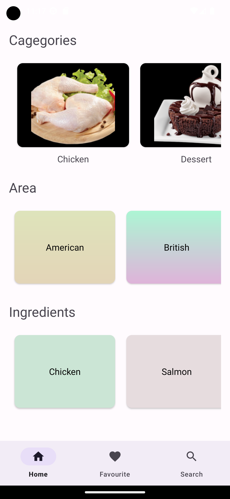
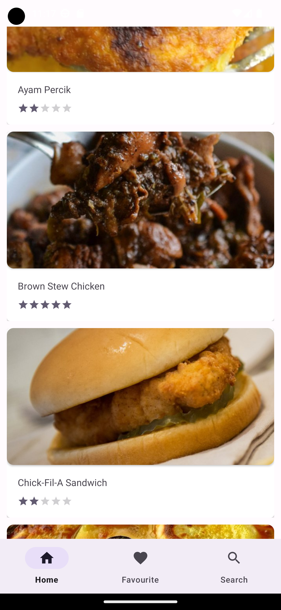
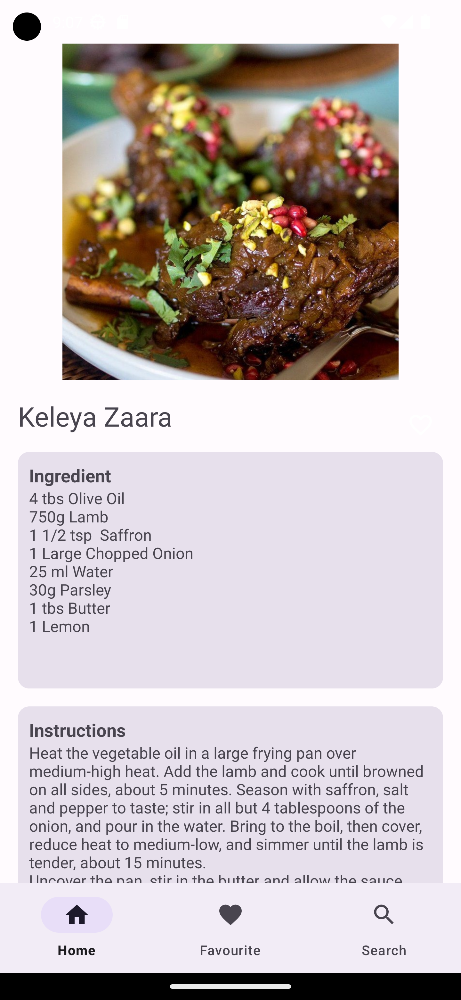
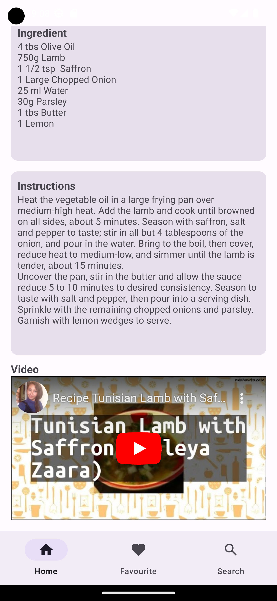

### FoodRecipe
FoodRecipe is a simple food recipe project with API network call provided by [The Meal DB](https://www.themealdb.com/api.php)

### Features
* Explore recipes based on categories, areas, ingredient
* Search recipe by specific keyword
* View detailed recipe information, including ingredients, instructions, and cooking guide video.

### Screenshots
 
---
 

### Description

* Tech/Tools
    * [Kotlin](https://kotlinlang.org/) 100% coverage
    * [Material design](https://material.io/design)
    * [Coroutines](https://kotlinlang.org/docs/reference/coroutines-overview.html) for asynchronous programming
    * [Hilt](https://developer.android.com/training/dependency-injection/hilt-android) for dependency injection
    * [ViewModel](https://developer.android.com/topic/libraries/architecture/viewmodel) that stores, exposes and manages UI state
    * [Retrofit](https://square.github.io/retrofit/) for network request call
    * [Glide](https://github.com/bumptech/glide) for image loading and caching library
    
* Modern Architecture
    * Single activity architecture
    * MVVM for presentation layer
    * [Android Architecture components](https://developer.android.com/topic/libraries/architecture) ([ViewModel](https://developer.android.com/topic/libraries/architecture/viewmodel))

### Presentation patterns layers
* View - The View represents the user interface and is responsible for displaying data and capturing user interactions. It observes changes in the ViewModel and updates the UI accordingly. In MVVM, the View is passive and doesn't contain business logic.
* ViewModel - The ViewModel acts as a mediator between the View and the Model. It exposes data and commands that the View can bind to. It retrieves data from the Model, prepares it for display, and provides methods for handling user actions. The ViewModel also maintains the state of the View.
* Model - The data represent the business logic of the application such as fetching data from the database or making network request

### Dependency injection
[Hilt](https://developer.android.com/training/dependency-injection/hilt-android) is used for Dependency Injection as a wrapper on top of [Dagger](https://github.com/google/dagger).
to increase code modularity, reusability, and testability by decoupling the dependent objects from the concrete implementations of their dependencies.

### License

**Now in Android** is distributed under the terms of the Apache License (Version 2.0). See the
[license](LICENSE) for more information.

